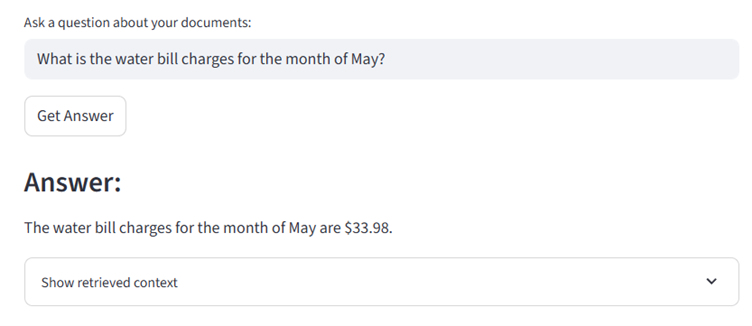
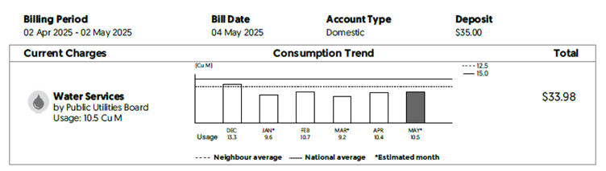
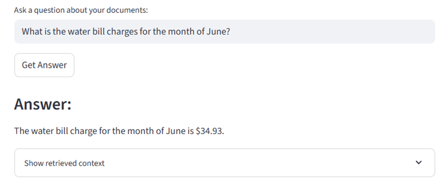
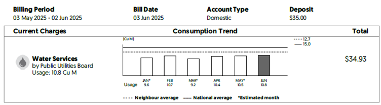

# 📄💬 Chat with Your Financial Documents (Local RAG)

This is a **Streamlit app** that lets you upload PDF financial documents (bank statements, bills, etc.) and chat with them using a local Retrieval-Augmented Generation (RAG) pipeline.  
All processing happens locally and privately — your documents and data never leave your machine.

Based on [Medium tutorial by Kirill Petropavlov](https://medium.com/@kpetropavlov/building-a-local-rag-pipeline-with-python-ollama-chromadb-and-streamlit-f248554d163c)
---

## Features

- Upload multiple PDF documents containing financial info  
- Extract text from PDFs using direct extraction and OCR fallback (for scanned pages)  
- Store document embeddings persistently with ChromaDB for fast semantic search  
- Query your documents with natural language questions  
- Use a local LLM (via Ollama) to generate answers based on retrieved document context  

---

## Tech Stack & Libraries

- [Streamlit](https://streamlit.io/) — Web UI framework  
- [PyMuPDF (fitz)](https://pymupdf.readthedocs.io/) — PDF reading and rendering  
- [pytesseract](https://pypi.org/project/pytesseract/) + [Tesseract OCR](https://github.com/tesseract-ocr/tesseract) — OCR for scanned PDFs  
- [Pillow (PIL)](https://python-pillow.org/) — Image processing for OCR  
- [ChromaDB](https://chroma.com/) — Vector database for document embeddings  
- [SentenceTransformers](https://www.sbert.net/) via ChromaDB for embedding text  
- [Ollama](https://ollama.com/) — Local LLM inference server (e.g. Llama 2)  
- `requests` — HTTP client to call Ollama API  

---

## Setup & Installation

1. **Clone the repo**

```bash
git clone https://github.com/nchinling/financial_doc_local_rag.git
cd https://github.com/nchinling/financial_doc_local_rag.git
```

2. **Create and activate a virtual environment**

```bash
python -m venv venv
source venv/bin/activate    # Linux / macOS
venv\Scripts\activate       # Windows
```

3. **Install Python dependencies**

```bash
pip install chromadb streamlit pymupdf pytesseract Pillow sentence-transformers
```

4. **Install Tesseract (open-source OCR engine)**
Windows installer
https://github.com/UB-Mannheim/tesseract/wiki


5. **Run the Streamlit app**
```bash
streamlit run app.py
```

---

## Demonstration: Results

### May water bill results  




### June water bill results  



